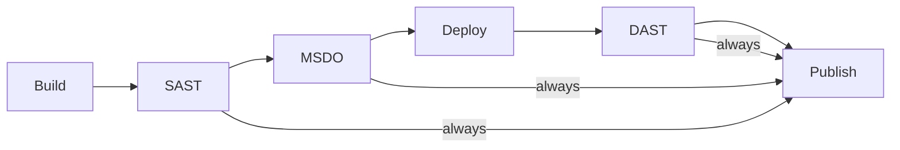

# Azure DevOps Security Pipeline — Team Documentation

This document explains the end-to-end CI/CD pipeline in this repository: what it
does, how it is structured, how to set it up, and how to troubleshoot it. It is
written for anyone on the team who needs to operate or modify the pipeline,
whether or not they have seen it before.

---

## 1. What this pipeline does

Every push to `main`, `master`, or `develop` (and every PR against `main` or
`develop`) triggers a fully automated pipeline that:

1. **Builds** a small ASP.NET Core web application into a deployable artifact.
2. **Scans the source code** for security issues (static analysis).
3. **Deploys** the built application to a Windows VM.
4. **Scans the running application** (dynamic analysis).
5. **Publishes** all scan results as reports that anyone can download.

In short: **build → secure → deploy → test → report.**

The pipeline is deliberately modular. The main entry file is thin and simply
chains together one template per stage. Almost everything is configurable
through a small set of variable files, so most day-to-day changes never require
touching pipeline logic.

> Note: the repository contains a *sample* application (`src/WebSample/`) used
> to exercise the whole flow. To build a real application, change the build
> variables (see section 6) — no template changes are required.

---

## 2. High-level flow

```
Build ──► SAST ──► MSDO ──► Deploy ──► DAST ──► Publish
```

| # | Stage   | Where it runs         | What it does                                                     |
|---|---------|-----------------------|------------------------------------------------------------------|
| 1 | Build   | Hosted Linux agent    | Publishes the app and stores it as the `drop` artifact           |
| 2 | SAST    | Hosted Linux agent    | Static analysis: TruffleHog (secrets) + Semgrep (code), in parallel |
| 3 | MSDO    | Hosted Windows agent  | Microsoft Security DevOps, produces a SARIF report               |
| 4 | Deploy  | Self-hosted Windows VM | Copies the artifact to `C:\site` and starts the app             |
| 5 | DAST    | Self-hosted Windows VM | OWASP ZAP scans the running app (spider + active scan)          |
| 6 | Publish | Hosted Linux agent    | Aggregates all findings and publishes reports (**always runs**) |



**Key design decision:** the **Publish** stage uses `condition: always()`. Even
if a security stage fails or is skipped, the reports are still generated and
published, so you never lose scan output because of a failing scanner.

---

## 3. Repository layout

```
├── doc.md                      # this document
├── global.json                 # pins the .NET SDK version used to build
├── src/
│   └── WebSample/              # sample ASP.NET Core web app (net10.0)
│       ├── WebSample.csproj
│       ├── Program.cs          # endpoints: /  /health  /echo
│       └── appsettings.json    # binds to http://0.0.0.0:5000
└── pipelines/
    ├── azure-pipelines.yml     # main pipeline: loads variables + stage templates
    ├── variables/              # every configurable value lives here
    │   ├── global.yml          #   agents, Python version, report paths
    │   ├── build.yml           #   build mode, project path, artifact name
    │   ├── security.yml        #   scanner versions/rules, policy gates
    │   └── deployment.yml      #   VM settings, app hosting, ZAP
    ├── templates/              # one file per stage
    │   ├── build.yml           #   stage 1
    │   ├── sast.yml            #   stage 2
    │   ├── msdo.yml            #   stage 3
    │   ├── deploy.yml          #   stage 4
    │   ├── dast.yml            #   stage 5
    │   └── publish.yml         #   stage 6
    └── scripts/                # the brains: Python + PowerShell
        ├── aggregate.py        #   parse all raw reports → combined.json
        ├── generate_html.py    #   combined.json → index.html dashboard
        ├── security_summary.py #   combined.json → summary.json / summary.md
        ├── policy_check.py     #   fail a job on critical/high findings
        ├── deploy.ps1          #   runs on the VM: stop/copy/start/wait
        ├── zap_scan.ps1        #   runs on the VM: headless ZAP scan
        ├── parser/             #   one parser per scanner
        └── shared/             #   common Finding model + dispatcher
```

### The three layers

1. **Orchestration** (`azure-pipelines.yml`) — which stages run and in what order.
2. **Templates** (`templates/*.yml`) — *how* each stage runs (its jobs and steps).
3. **Variables** (`variables/*.yml`) — *what* values each stage uses.

The rule of thumb: **configuration changes go in `variables/`, behaviour changes
go in `templates/` or `scripts/`.** There is no hardcoded path, URL, or version
buried inside a stage template.

---

## 4. The sample application

`src/WebSample/` is a minimal ASP.NET Core web app (target framework `net10.0`):

| Route   | Behaviour                                   |
|---------|---------------------------------------------|
| `/`     | Returns the text `WebSample is running.`    |
| `/health` | Returns JSON `{ "status": "ok" }`         |
| `/echo?q=...` | Reflects user input back to the browser (see warning below) |

It is **self-hosted** (Kestrel) and binds to `http://0.0.0.0:5000`
(`appsettings.json`). It runs on the VM with `dotnet WebSample.dll` from
`C:\site`.

> **Security note:** the `/echo` endpoint deliberately echoes user input without
> escaping. This is an intentional sample flaw so that Semgrep and OWASP ZAP
> actually have something to flag — it demonstrates how findings flow into the
> reports. **Do not copy this pattern into a real application.**

---

## 5. Stage-by-stage walkthrough

### Stage 1 — Build (`templates/build.yml`, hosted Linux agent)

Produces a single deployable artifact called `drop`.

- **Publish mode** (default, `BuildMode = publish`): runs
  `dotnet restore` + `dotnet publish` on `src/WebSample/WebSample.csproj`
  (framework `net10.0`, configuration `Release`), verifies `WebSample.dll` was
  produced, then publishes it as the `drop` artifact.
- **Copy mode** (`BuildMode = copy`): instead of compiling, it packages a
  directory verbatim (excluding `.git`, `bin`, `obj`). Useful for static
  content or pre-compiled output.

No security scanning happens here.

### Stage 2 — SAST (`templates/sast.yml`, hosted Linux agent)

Two independent jobs run **in parallel** — if one fails, the other still runs.

| Job        | Scanner                 | What it checks                     | Report file(s)          |
|------------|-------------------------|-------------------------------------|-------------------------|
| `TruffleHog` | [TruffleHog](https://github.com/trufflesecurity/trufflehog) | Leaked secrets/credentials in git history | `trufflehog.json` |
| `Semgrep`   | [Semgrep](https://semgrep.dev) | Static code analysis (ruleset `p/security-audit`) | `semgrep.json`, `semgrep.sarif` |

Both jobs follow the same four-step pattern:

1. **Install** the scanner.
2. **Scan** the repository (`continueOnError: true`, so output is always archived).
3. **Archive** results as a pipeline artifact (`condition: always()`).
4. **Policy gate**: runs `policy_check.py`, which fails the job if critical/high
   findings exist (see section 7).

Because the policy-gate step also runs on `always()`, a scanner that crashes
(and therefore produces no report) also fails the job — the pipeline never
silently passes a broken scan.

### Stage 3 — MSDO (`templates/msdo.yml`, hosted Windows agent)

Runs **Microsoft Security DevOps**, Microsoft's collection of security tools
(BinSkim, Bandit, Checkov, Terrascan, Trivy, template analyzers, etc.), against
the repository and produces a consolidated SARIF file.

Flow inside the job:

1. `MicrosoftSecurityDevOps@1` task runs the scan. It publishes its SARIF as a
   pipeline artifact named `CodeAnalysisLogs` (this is the tool's own contract —
   the task does **not** write into our reports folder).
2. The job downloads `CodeAnalysisLogs` back and consolidates the first `*.sarif`
   file into `reports/raw/msdo.sarif`.
3. Results are archived as the `msdo` artifact.
4. A policy gate runs (same `policy_check.py`).

**Prerequisite:** the *Microsoft Security DevOps* extension must be installed in
your Azure DevOps organization (Marketplace → Manage extensions). Without it the
`MicrosoftSecurityDevOps@1` task cannot be resolved.

### Stage 4 — Deploy (`templates/deploy.yml`, self-hosted Windows VM)

Downloads the `drop` artifact and runs `scripts/deploy.ps1`, which executes
**directly on the VM** through the self-hosted agent:

1. **Stop** the app (only if a Windows service is configured).
2. **Copy** the new build output into `C:\site` with `robocopy`.
3. **Start** the app. Two hosting modes are supported (mutually exclusive):
   - **Self-hosted app** (current config): `Start-Process dotnet WebSample.dll`
     from `C:\site`.
   - **Windows service**: stop/start a named service (`WindowsServiceName`).
4. **Wait** until the app answers at `ApplicationUrl` (`http://localhost:5000`),
   polling every 5 seconds for up to 300 seconds.

`deploy.ps1` includes pre-flight checks and logs the app's own stdout/stderr on
failure, so a bad deployment fails with a useful message instead of a silent
timeout.

### Stage 5 — DAST (`templates/dast.yml`, self-hosted Windows VM)

Runs **OWASP ZAP** (already installed on the VM) against the deployed
application. The pipeline never downloads or installs ZAP.

Flow inside `zap_scan.ps1`:

1. Pre-flight checks: ZAP exists, Java is present, and the target app is
   reachable from the agent.
2. Start ZAP in headless daemon mode (its REST API listens on port 8090).
3. **Spider** the target to discover URLs.
4. **Active scan** the discovered URLs.
5. Export `zap.json`, `zap.xml`, and `zap.html`.
6. Shut the daemon down.

Results are archived as the `zap` artifact and a policy gate runs. Because the
scan runs on the VM itself, the target is addressed as `localhost`/`127.0.0.1`.

### Stage 6 — Publish (`templates/publish.yml`, hosted Linux agent)

Collects everything and makes it available to the team. This stage:

- **Downloads** every scanner's raw artifact (`trufflehog`, `semgrep`, `msdo`,
  `zap`) — each download is best-effort (`continueOnError`), so a scanner that
  didn't run simply contributes nothing.
- **Aggregates** all findings into one normalized `combined.json`
  (`aggregate.py`).
- **Generates** a single-page HTML dashboard (`index.html`) and a Markdown
  summary (`summary.md`) — both skipped when `PublishReports` is `false`.
- **Publishes** three artifacts: `reports-raw`, `reports-html`, `reports-summary`.

It depends on `[SAST, MSDO, DAST]` (so the scanner artifacts exist before it
runs) and uses `condition: always()` (so it runs even when those stages failed).

---

## 6. Configuration

Everything configurable lives in `pipelines/variables/`. Values that are
machine-specific or environment-specific (the VM pool, paths, URLs) live in
`deployment.yml` and are expected to be overridden per environment (e.g. with a
variable group).

### `global.yml` — cross-cutting

| Variable               | Default                  | Purpose                          |
|------------------------|--------------------------|----------------------------------|
| `AgentImage`           | `ubuntu-latest`          | Hosted image for Linux jobs      |
| `WindowsAgentImage`    | `windows-latest`         | Hosted image for Windows jobs    |
| `PythonVersion`        | `3.11`                   | Python used by report scripts    |
| `RawReportsDirFull`    | `$(Build.ArtifactStagingDirectory)/reports/raw` | Where raw scanner files land |
| `HtmlReportsDirFull`   | `.../reports/html`       | Where the HTML dashboard goes    |
| `SummaryReportsDirFull`| `.../reports/summary`    | Where summaries go               |

Reports are always written to the agent's staging area — **never committed to
the repository**.

### `build.yml` — build settings

| Variable           | Default                                   | Purpose                                    |
|--------------------|-------------------------------------------|--------------------------------------------|
| `BuildConfiguration` | `Release`                               | Build configuration                        |
| `ArtifactName`     | `drop`                                     | Name of the deployable artifact            |
| `SampleProjectPath`| `src/WebSample/WebSample.csproj`           | Project published in `publish` mode        |
| `PublishFramework` | `net10.0`                                  | Target framework (matches `global.json`)   |
| `BuildMode`        | `publish`                                  | `publish` or `copy`                        |
| `CopySourcePath`   | `$(Build.SourcesDirectory)`                | Source path for `copy` mode                |

### `security.yml` — scanner settings

Key items: `SemgrepRules` (`p/security-audit`), `SemgrepVersion` (empty = latest),
`TrufflehogVersion`, `MsdoPolicy` (`azuredevops`), plus:

- **Policy gates:** `FailOnCritical = true`, `FailOnHigh = true` — findings at
  these severities fail the job.
- **Report file names:** `semgrep.json`, `semgrep.sarif`, `trufflehog.json`,
  `msdo.sarif`, `zap.json`, `zap.xml`, `zap.html`. These must match what the
  scanners write and what the Python parsers expect.
- **Artifact names:** `trufflehog`, `semgrep`, `msdo`, `zap` — the Publish stage
  downloads these by name, so keep them in sync if renamed.

### `deployment.yml` — VM + DAST settings

| Variable             | Default                                           | Purpose                                  |
|----------------------|---------------------------------------------------|------------------------------------------|
| `VmPool`             | `cloud-poc`                                       | Self-hosted agent pool on the VM         |
| `SitePath`           | `C:\site`                                         | Where the app is deployed on the VM      |
| `ApplicationUrl`     | `http://localhost:5000`                           | Reachability probe + DAST target         |
| `WindowsServiceName` | *(empty)*                                         | Set to host the app as a Windows service |
| `StartCommand`       | `dotnet WebSample.dll`                            | Command to launch the self-hosted app    |
| `WaitTimeoutSeconds` | `300`                                             | Deploy probe timeout                     |
| `ProbeIntervalSeconds`| `5`                                              | Deploy probe interval                    |
| `ZapPath`            | `C:\Program Files\ZAP\Zed Attack Proxy\zap.bat`   | Pre-installed ZAP launcher on the VM     |
| `ZapTarget`          | `$(ApplicationUrl)`                               | URL ZAP scans                            |
| `ZapTimeout`         | `600`                                             | ZAP spider + active-scan budget          |
| `ZapApiPort`         | `8090`                                            | ZAP REST API port                        |
| `PublishReports`     | `true`                                            | Set `false` to publish only raw reports  |

**Hosting modes are mutually exclusive.** If `WindowsServiceName` is set, the
app is stopped/started as a service. Otherwise `StartCommand` launches the
self-hosted app. Leave one empty.

---

## 7. Policy gates and the severity model

All scanner reports are normalized into a single model with five severities:
`critical`, `high`, `medium`, `low`, `info`.

Each security job ends with `policy_check.py`. It fails the job when the report
contains findings at a gated severity (`FAIL_ON_CRITICAL`, `FAIL_ON_HIGH`,
default both `true`). Its exit codes:

| Exit | Meaning                                             |
|------|-----------------------------------------------------|
| 0    | No findings above the threshold                     |
| 1    | Findings above the threshold (gate violated)        |
| 2    | Report missing/corrupt (a crashed scanner)          |

Because the gate runs on `condition: always()`, a missing report also fails the
job — a broken scanner can never silently pass.

---

## 8. Reports and artifacts

Raw scanner output is archived per scanner (`trufflehog`, `semgrep`, `msdo`,
`zap`) and then re-combined by the Publish stage into:

| Artifact        | Contents                                          |
|-----------------|---------------------------------------------------|
| `reports-raw`   | All original scanner files (`*.json`, `*.sarif`, `*.xml`, `*.html`) |
| `reports-html`  | A single-page `index.html` security dashboard (severity cards, tables grouped by severity and by scanner) |
| `reports-summary` | `combined.json` (all findings, normalized), `summary.json` (counts), `summary.md` (readable report) |

Download these from the pipeline run page (Artifacts → drop-down) after any run.

You can also run the aggregation scripts locally, e.g.:

```bash
pipelines/scripts/aggregate.py --raw reports/raw --output reports/summary/combined.json
pipelines/scripts/generate_html.py --combined reports/summary/combined.json --output reports/html/index.html
pipelines/scripts/security_summary.py --combined reports/summary/combined.json \
    --json reports/summary/summary.json --markdown reports/summary/summary.md
```

---

## 9. Prerequisites and setup

### Azure DevOps organization

1. **Point a pipeline at `pipelines/azure-pipelines.yml`** (Pipelines → New
   pipeline → Azure Repos Git → select this repository).
2. **Install the Microsoft Security DevOps extension** (Marketplace → Manage
   extensions → Microsoft Security DevOps). Required for the MSDO stage.
3. Make sure the build can use hosted agents (`ubuntu-latest`,
   `windows-latest`) — no extra setup needed for those.

### The Windows VM (self-hosted agent)

The Deploy and DAST jobs run on the VM through a self-hosted agent. The VM needs:

1. **A self-hosted agent** registered in the pool named by `VmPool`
   (default `cloud-poc`).
2. **The .NET 10 runtime** (e.g. the ASP.NET Core Runtime or Hosting Bundle
   installer) so the deployed app can run. **Restart the agent service after
   installing** so the agent's environment picks up the new `PATH`.
3. **OWASP ZAP** installed at `ZapPath`
   (`C:\Program Files\ZAP\Zed Attack Proxy\zap.bat`), and a **Java runtime**
   (ZAP needs Java 11+, 17+ for newer versions) available on the agent's `PATH`.
4. **Python** on the VM if the ZAP policy gate runs there (see the `dast.yml`
   TODO — an alternative is to move that gate to a hosted job).
5. Write access to `SitePath` (`C:\site`) for the agent account.

---

## 10. Triggering runs

```yaml
trigger:
  branches: { include: [main, master, develop] }   # CI on every push
pr:
  branches: { include: [main, develop] }           # PR validation
```

- A push to those branches runs the whole pipeline.
- A pull request against those branches runs it as PR validation.
- You can also run it manually from the Pipelines page (Run pipeline).

---

## 11. Troubleshooting

Practical guidance based on real issues hit during development.

### Pipeline-level

| Symptom | Likely cause | Fix |
|---------|--------------|-----|
| `A sequence was not expected` in a stage template | Template missing the `stages:` wrapper | Ensure each template starts with `stages:` before `- stage:` |
| Arguments after a certain point silently ignored (e.g. `StartCommand` never bound) | A blank line inside a folded `>-` YAML block injects a literal newline into the value, splitting the argument string | Remove blank lines inside `arguments: >-` blocks |
| Publish runs too early / reports empty | Publish only depended on Build, so it ran before scanners produced artifacts | `dependsOn: [SAST, MSDO, DAST]` (with `condition: always()`) |

### MSDO

| Symptom | Likely cause | Fix |
|---------|--------------|-----|
| `Missing argument in parameter list` / parser errors during "Install Microsoft Security DevOps" | The old `aka.ms/install-azsdopackage.ps1` bootstrap URL now serves an HTML page, not a script | The bootstrap step has been removed; use the `MicrosoftSecurityDevOps@1` task with the extension installed |
| `MicrosoftSecurityDevOps@1` task not found | Extension not installed in the organization | Install the Microsoft Security DevOps extension |
| `MSDO produced no SARIF output` | `policy` set to an invalid value (e.g. `GitHub`), or looking for output in the wrong directory | Use `azuredevops`/`microsoft`/`none`; the task publishes SARIF to the `CodeAnalysisLogs` artifact, which the job downloads |

### Deploy / VM

| Symptom | Likely cause | Fix |
|---------|--------------|-----|
| `Application did not become reachable ... within 300s` and no app log | `dotnet` not on the agent's `PATH`, or the .NET runtime not installed | Install the .NET 10 runtime on the VM and restart the agent service |
| IIS: `Cannot read configuration file due to insufficient permissions` | Agent account cannot read IIS config (`inetsrv\config`) | Run the agent with sufficient rights — or use the self-hosted app mode (simpler for this sample) |
| App not reachable during DAST but reachable at deploy time | The self-hosted process died or was not supervised after the deploy job ended | Consider hosting the app as a Windows service |

### ZAP / DAST

| Symptom | Likely cause | Fix |
|---------|--------------|-----|
| `Unable to access jarfile zap-2.17.0.jar` | `zap.bat` uses a relative jar path; it must run from the ZAP install directory | The script now launches ZAP with its own directory as the working directory |
| `NativeCommandError` from `java -version` | Windows PowerShell 5.1 treats native stderr as an error when `$ErrorActionPreference = 'Stop'` | The script temporarily relaxes EAP around the `java -version` call |
| Spider completes but the site tree is empty; `ascan` says `url_not_found` | ZAP resolved `localhost` to IPv6 (`::1`) while the app binds IPv4 only, so ZAP never reached it | The script normalizes `localhost` → `127.0.0.1` and seeds the URL into the tree |
| ZAP daemon never becomes ready on port 8090 | Java missing on the agent `PATH`, or ZAP can't start | Check the `java:` line and the dumped `zap-daemon.*.log` in the run output |

### General debugging tips

- The Deploy and ZAP scripts deliberately dump the app's/daemon's own stdout and
  stderr when something isn't reachable — read those lines first; they usually
  state the real error.
- Reports are published as artifacts even on failed runs, so download them to
  see exactly what each scanner found.

---

## 12. Extending the pipeline

### Adding a new scanner (Trivy, Gitleaks, Checkov, …)

Exactly three things change:

1. **A job** in the relevant stage template (`templates/sast.yml` for static
   tools), following the existing pattern:
   `install → run (continueOnError) → archive (always) → policy_check`.
2. **A parser module** `scripts/parser/<scanner>.py` returning a list of
   `Finding` objects, registered in `scripts/shared/dispatch.py`.
3. **Variables** in `pipelines/variables/security.yml` (report file name,
   artifact name, version).

Nothing else changes — the Publish stage picks new reports up automatically
because aggregation is driven by the dispatcher.

### Building a real application instead of the sample

In `pipelines/variables/build.yml`, set `SampleProjectPath` to your real
project (and keep `BuildMode = publish`). No template changes needed.

### Recommended production hardening (marked TODO in the code)

- Run the deployed app as a **Windows service** so it survives restarts and is
  supervised (the self-hosted `Start-Process` is only for the sample).
- Replace ZAP's `api.disablekey=true` with a real API key stored as a pipeline
  secret, and restrict what ZAP may crawl.
- Wire the HTML dashboard's file links to a real code host.
- Bump scanner versions (e.g. `TrufflehogVersion`) to recent releases.
